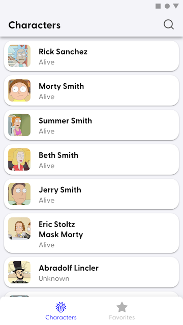
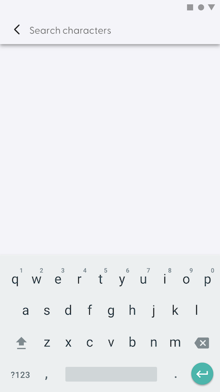
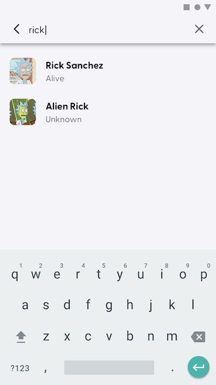
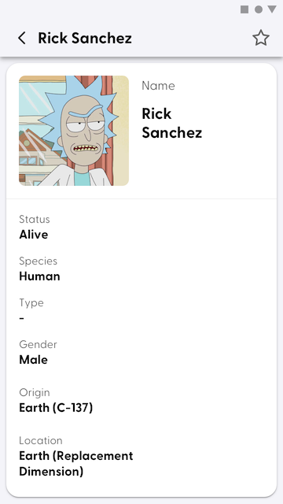
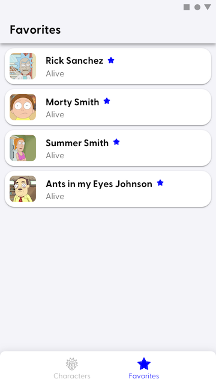

# Android Task - Rick and Morty Characters

## Description

Goal of this app is to display a bunch of information about the characters of the Rick and Morty universe. Don't know Rick and Morty? Well it's a
shame, because it's the best TV show!

## API

There is a public [API](https://rickandmortyapi.com/documentation) you should use. The API offers access through GraphQL or traditionally via REST.
There is also an already implemented client for Java which you can use. It's up to you.

## Design

We have our own unique design for this task which you can find in the
Abstract [here](https://share.goabstract.com/9f8f1ad7-5b07-41ed-94f2-b915a0948453?collectionLayerId&mode). There is separate design for iOS and
Android so choose the correct one. There is also support for Dark mode and Design system definition.

## Repository

This repository contains a basic skeleton for the app. However, it's just an empty project generated by Android Studio so feel free to change it
anyhow you like.

## Screens

### List of characters

Display a list of characters. Since there are 600+ characters on the API you cannot fetch all of them at once - you should use some sort of paging.
The API is ready for that.

#### API resources

- https://rickandmortyapi.com/documentation/#get-all-characters

#### Design

### Search of characters

Since there are so many characters and you may have an urge to find the specific one there is an option to search characters by name. Again, this
filtered list should be paged.

#### API resources
- https://rickandmortyapi.com/documentation/#filter-characters

#### Design

### Character detail 
Display detail of a single character. You can add or remove the character to the Favorites.

Favoriting characters is not part of the API, it has to be implemented in the app.

#### API resources
- https://rickandmortyapi.com/documentation/#get-a-single-character

#### Design

### Favorite characters

Display a list of favorite characters. You can open a detail of a character from the list. 

#### Design

## Requirements

Implement as much requirements as possible 

- The app has to be written in Kotlin
- Define UI of the app however you like (we've heard that Compose is some new thing now 😎)
- Use any asynchronous framework you fancy like RxJava or Coroutines
- Follow principles of Clean Architecture and use any recommended UI architecture like MVVM, MVI or MVP.
- The app should follow system Dark mode settings
- Application should be able to run on every device and every orientation (however we don't have separate design for tablets)
- Use 3rd party libraries, technologies and frameworks as you wish. But have a good reason to use any of them, though.
- If you want to add anything extra, just go for it! (Psst, we ❤️ testing)
- Send us as a link to your git repository with the source code.

